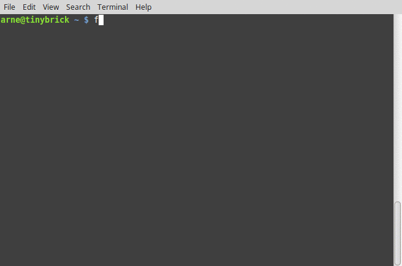

flickr-album-embed-codes
========================

.. image:: http://img.shields.io/badge/license-BSD-yellow.svg
   :alt: BSD License
   :align: left
   :target: http://opensource.org/licenses/BSD-3-Clause

.. image:: https://www.quantifiedcode.com/api/v1/project/06c5b36327504bccbff940da5603c527/badge.svg
   :alt: Code issues
   :align: left
   :target: https://www.quantifiedcode.com/app/project/06c5b36327504bccbff940da5603c527

The ``flickr-album-embed-codes`` script lets you embed all the pictures of a Flickr
album into your website or (wordpress) blog by extracting their HTML embed codes.

Installation
------------

Download or clone the repository, then follow the OS-specific instructions.

::

    git clone https://github.com/arne-cl/flickr-album-embed-codes.git
    cd flickr-album-embed-codes

Ubuntu 14.04
~~~~~~~~~~~~

::

    sudo apt-get install firefox git python-setuptools xvfb
    sudo python setup.py install

docker
~~~~~~

Build the docker container using the ``Dockerfile`` in this directory.
Afterwards just run the container with the same parameters you would run the
``flickr-album-embed-codes`` script.

::

    docker build -t flickr-album-embed-codes .
    docker run -ti flickr-album-embed-codes https://www.flickr.com/photos/USER/sets/ALBUM_ID

Usage
-----

::

    flickr-album-embed-codes -h
    usage: extract HTML embed codes from a Flickr album [-h] [--debug]
                                                  album_url [output_file]

    positional arguments:
      album_url    URL of the Flickr album/photoset to extract embed codes from
      output_file  output file for photo embed codes

    optional arguments:
      -h, --help   show this help message and exit
      --debug      enable debug mode

Usage example
~~~~~~~~~~~~~

This will extract the HTML embed codes of all the images in the given Flickr album
and store them in the file ``embed.html``:

::

    flickr-album-embed-codes https://www.flickr.com/photos/USER/sets/ALBUM_ID embed.html
